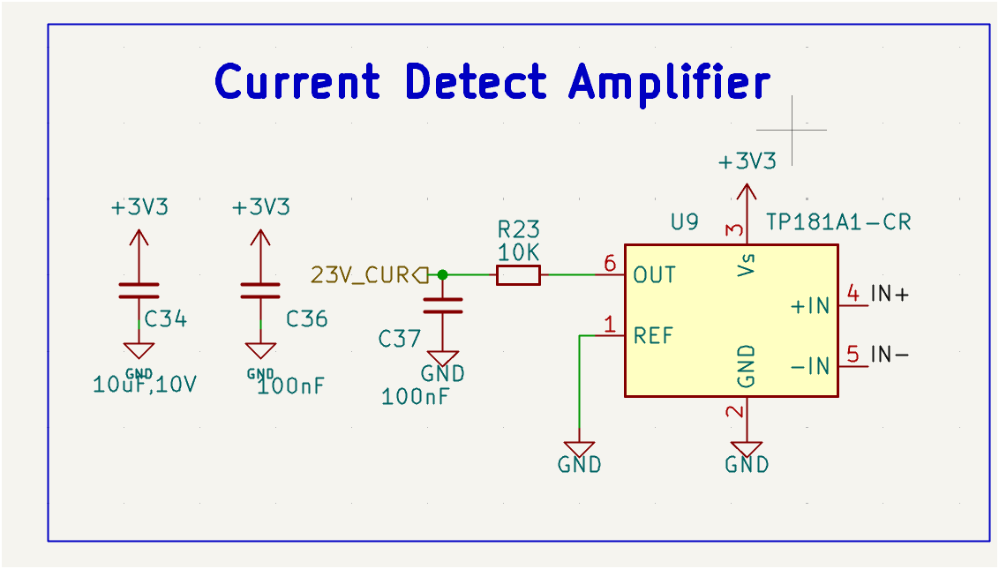
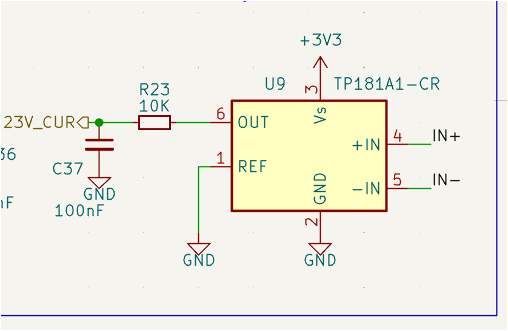
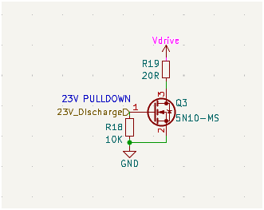
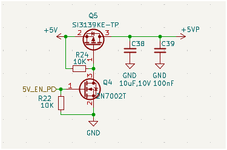
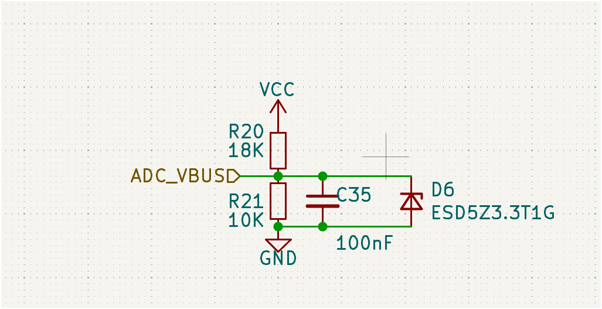
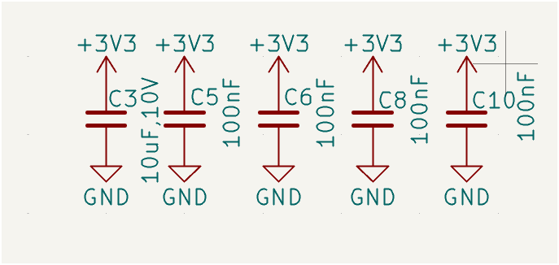
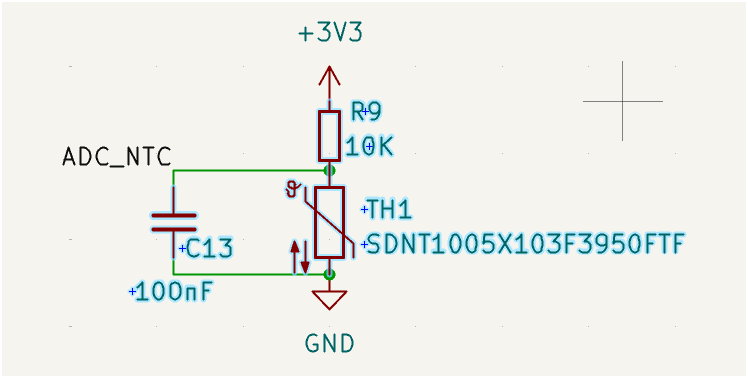
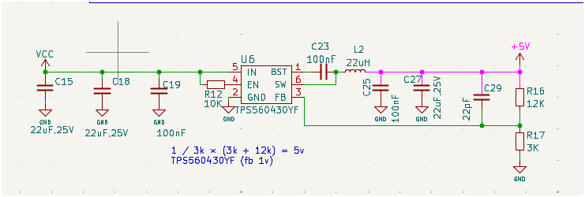
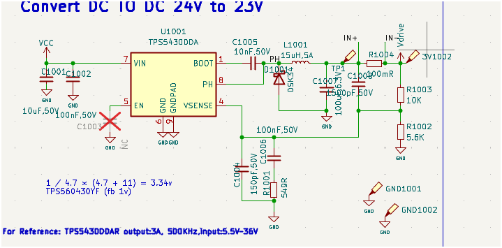

原始整理日期：2026-07-13  
适用范围：`AT32 + FPGA + 24V 输入 + 23V / 5V / 3.3V / 1.2V` 混合系统 PCB 设计  

---

## 1. 使用说明

- 这份笔记不是聊天记录整理，而是把对话里反复出现的工程结论收敛成可查阅手册。
- 优先级最高的内容是：`电源架构`、`DCDC 回路`、`晶振`、`U3 ↔ U11 互连`、`模拟采样`。
- 文中所有宽度、过孔、分层建议，默认前提是常规四层板工艺；正式投板前仍需结合板厂能力和 DRC 规则核对。
- 单独新增了一个大类：`电路截图归档与解读`，把你上传过的典型原理图片、你当时的问题焦点、以及对应该电路的工程结论，全部集中在一起，不分散到其他章节。

---

## 2. 项目总体架构

### 2.1 电源层级

- `VCC` 在本项目中应理解为 **24V 原始输入母线**，不应再把它当作逻辑电源名。
- `U1001 (TPS5430DDA)`：`24V -> 23V`，主要服务 `Vdrive`、高压侧、放电/测流链路。
- `U6 (TPS560430YF)`：`24V -> 5V`。
- `Q5 + Q4`：实现 `+5V -> +5VP` 的受控高边开关。
- `U5`：生成 `+3V3`。
- `+1V2`：主要给 `U11` 使用，应就近、局部、低阻抗供电。

### 2.2 必须确认的电气事实

- `+3V3` 只能有 **一个真实稳压源**，不能把两个稳压器输出并在同一网络。
- `ADC_VBUS` 是 `VCC` 的 **分压采样点**，不是供电干线。
- `23V_CUR` 是 **测流放大器输出到 MCU ADC 的模拟量**，不是功率走线。
- `+5VP` 是 **受控输出**，不是主 `5V` 电源树的起点。

### 2.3 本项目典型功能区

- `24V 输入 + 保险丝 + DCDC`：板边电源入口区
- `U3 (AT32)`：主控中心
- `U11 (FPGA / 高速逻辑)`：协处理或可编程逻辑核心
- `J3 / J4 / 排针 / FPC`：接口区
- `Y1 + C4 + C7`：时钟敏感区
- `U9 + 分流电阻`：测流模拟区
- `Q3`：23V 放电/拉低
- `Q5/Q4`：5VP 受控输出

---

## 3. 四层板总体策略

### 3.1 推荐层叠

- `L1 (F.Cu)`：关键器件、晶振、DCDC 热回路、短而关键的信号
- `L2 (In1.Cu)`：整层连续 `GND`
- `L3 (In2.Cu)`：电源分配，或部分次级信号
- `L4 (B.Cu)`：补充走线、连接器扇出、局部功能回绕

### 3.2 核心原则

- `L2` 必须优先保持连续、完整、低割裂的地平面。
- `L3` 可以承担电源分发，但不能破坏关键回流路径。
- 晶振、ADC、测流、DCDC 的参考地都应优先依赖 `L2`。
- 顶层和底层的铜皮不能只看“连没连上”，要看回流、噪声和寄生效应。

### 3.3 双层板可行性判断

- 理论上能改双层，但代价很大。
- 当板上同时存在：
  - MCU 与 FPGA 的密集互连
  - 多路电源
  - 晶振、ADC、测流等敏感模拟区
  - FPC / 连接器密集扇出
- 结论通常是：**四层更合理，双层不推荐作为首选实现。**

---

## 4. 器件摆放方法论

### 4.1 功能分区原则

- 电源入口和高压功率器件靠近板边，减少高压大电流主干在板上横穿。
- MCU、FPGA 放在逻辑中心，先保证互连，再考虑外围小器件。
- 晶振紧贴 MCU 晶振脚，不能为了“整体好看”被挪远。
- 测流前端紧贴分流电阻，不能把 `IN+ / IN-` 拉成长采样线。
- `5VP` 受控开关应靠近输出连接器，减少受控 5V 输出回路长度。

### 4.2 摆放顺序

1. 先摆核心芯片和主要连接器
2. 再摆电源
3. 再摆晶振、ADC、测流
4. 最后摆杂项阻容

### 4.3 走线优先级

1. 晶振
2. DCDC 热回路
3. `U3 ↔ U11` 关键控制线
4. 模拟采样线
5. 主电源分配
6. 普通 GPIO

### 4.4 过孔的工程理解

- 过孔多并不自动等于错误。
- 真正的问题是：
  - 关键线是否无意义换层
  - 回流是否被切断
  - 采样线是否和噪声线共层缠绕
- `U3 ↔ U11` 中打很多过孔可以是合理方案，但必须是“受控扇出”，不是随机穿孔。

---

## 5. 电源架构与布线专题

### 5.1 VCC / 24V 主干

- `VCC` 是 **24V 原始输入母线**。
- `24V` 主干 **不能接地**。
- 正确理解不是“24V 需不需要接地”，而是：
  - `24V` 负责送电
  - `GND` 负责回流
  - 两者一起才构成完整回路

### 5.2 24V 主干该怎么分配

- 从输入口/保险丝 `F1` 后做 **短粗分叉**。
- 主分支推荐去：
  - `U1001 VIN`
  - `U6 VIN`
  - `ADC_VBUS` 分压上端
  - 其他真正吃原始 24V 的功能块
- 不推荐把 `VCC` 绕板一圈再回到负载。

### 5.3 3.3V 网络

- 3.3V 只能有一个真正源头。
- 从稳压源出发，再按功能分支到 MCU、FPGA、模拟外围。
- 不建议负载串负载式供电。

### 5.4 5V 网络

- `+5V` 应从 `U6` 输出节点引出，而不是从反馈支路或测试点起走。
- `+5VP` 是受控输出，不应反向作为主 `+5V` 来源。
- 多个 5V 用点，优先从主 5V 铜皮或干线分出，不要理解成“两个 5V 源串联供电”。

### 5.5 电源填充区的作用

- 降低阻抗
- 提高载流能力
- 改善散热
- 让电源分配更稳定

### 5.6 电源填充区的误区

- 不是所有空白都要填满。
- 不能把敏感模拟节点、晶振区、开关噪声区随意包围。
- 不能铺错网络。
- 不能把回流路径切断后再自以为“铜更多更好”。

### 5.7 电源填充区的操作原则

- 先定网络，再选层，再画区。
- 优先让 `L2` 做 GND。
- `L1` 只做必要局部电源铜皮。
- 电源铜皮铺完必须按 `B` 重填充并检查是否形成孤岛。

---

## 6. DCDC 设计专题

### 6.1 TPS5430 / TPS560430 的 PCB 原则

- 输入电容紧贴 `VIN` 和 `GND`
- `SW/PH` 节点短、粗，但面积不要无脑做很大
- 电感紧贴 `SW/PH`
- 输出电容紧贴电感输出侧
- `BST` 自举电容紧贴 `BST` 与 `SW`
- `FB/VSENSE` 远离 `SW` 噪声区
- 反馈分压应靠近反馈脚，不要穿越高噪声区

### 6.2 哪些线要粗

- `VIN` 主输入线：粗
- `SW/PH -> 电感 -> 输出电容` 功率回路：粗、短
- 输出主干：按实际电流选较粗宽度或铜皮
- `BST`：不需要粗，但必须很近
- `FB/EN/VSENSE`：不需要粗，重点是安静

### 6.3 对 BST 和 SW 的结论

- `SW/PH` 是功率节点，优先短且粗
- `BST` 是驱动节点，不必粗，但自举电容必须靠近

### 6.4 经验线宽

- 功率段：`0.5 mm ~ 1.0 mm` 起步
- 大电流主干：`0.8 mm` 以上或铜皮
- `BST`：`0.12 mm ~ 0.2 mm`
- `FB / EN`：`0.1 mm ~ 0.15 mm`

### 6.5 DCDC 摆放顺序

1. 芯片
2. 输入电容
3. 自举电容
4. 电感
5. 输出电容
6. 反馈网络

### 6.6 DCDC 最容易犯的错

- `SW` 铜皮太大
- 反馈线从 `SW` 下方穿过
- 输入电容离芯片太远
- 输出电容放在电感之后很远的位置
- 地回流绕大圈

---

## 7. 晶振专题

### 7.1 摆放原则

- 晶振必须尽量贴近 MCU 的 `OSCI/OSCO` 引脚。
- 两颗负载电容紧贴晶振两端。
- 每颗电容地端各自就近打 `GND via`。
- 不要放测试点，不要换层，不要让别的高速线从附近穿过。

### 7.2 布线顺序

1. 先连 `MCU OSCI -> 晶振`
2. 再连 `MCU OSCO -> 晶振`
3. 再从两个振荡节点分别接负载电容
4. 最后把两颗电容各自下地

### 7.3 线宽

- 推荐：`0.10 mm ~ 0.15 mm`
- 更推荐统一用：`0.12 mm`
- 不建议刻意加宽到 `0.2 mm` 以上

### 7.4 顶层和内层处理

- 顶层可小范围铺 `GND`
- 晶振附近只能铺 `GND`，不要铺 `+3V3 / VCC / +5V`
- `L2 GND` 通常不要挖空
- 重点是给晶振一个安静、连续的参考地环境

### 7.5 晶振是否要挖空

- 一般不需要大面积挖空
- 真正应避免的是：
  - 杂网铜皮靠得太近
  - 高速线从晶振正下方穿过
  - 地平面被切断

### 7.6 晶振区域常见误区

- 晶振线太长
- 晶振线打过孔
- 电容离晶振太远
- 两个电容共用一根长地线
- 晶振附近穿过 `MCO / SWD / PH`

---

## 8. U3 与 U11 互连专题

### 8.1 优先保证的信号

- `/FGPA_CLK`
- `/FPGA_CS`
- `/FPGA_INT_N`
- `/FPGA_RST_N`
- `/MCO`

### 8.2 可适当妥协的信号

- `/FPGA_IO0`
- `/FPGA_IO1`
- `/FPGA_IO2`
- `/FPGA_IO3`
- `/PSRAM_CS`

### 8.3 走线原则

- 关键线优先短、少过孔、少换层。
- 可容忍的总线类信号允许成组走 `L3` 或底层。
- 不要为“完全平行”而强行绕远。
- 优化的目标是电气优先级，不是视觉优先级。

### 8.4 引脚交换策略

- 可交换时优先挪动低风险 GPIO。
- 像 `/FPGA_INT_N` 这种普通中断输入脚，通常比时钟、复位更适合交换。
- 交换引脚的前提是先确认协议和外设复用不会被破坏。

---

## 9. 模拟采样与测流专题

### 9.1 U9 测流前端

标准高边分流测流思路：

`23V 电源 -> 分流电阻 -> 负载`

- `IN+` 接分流电阻电源侧
- `IN-` 接分流电阻负载侧
- `REF` 接 `GND`
- `VS` 接 `+3V3`
- `OUT -> R23 -> 23V_CUR -> MCU ADC`

### 9.2 测流走线原则

- 大电流路径：宽、短
- `IN+ / IN-` 采样线：Kelvin 引出，细、短、对称
- 采样线不要和功率铜皮混在一起
- 不必默认在 `IN+ / IN-` 上串电阻

### 9.3 ADC_VBUS 分压

这是“分压 + RC 滤波 + 钳位”结构：

- `R20 / R21`：分压
- `C35`：滤波
- `D6`：钳位 / ESD

布局原则：

- `R20` 靠高压侧
- `R21 + C35 + D6` 靠 MCU ADC 侧
- 采样线远离开关电源噪声区

### 9.4 模拟线的判断标准

- 优先短
- 优先安静
- 优先参考连续地
- 不要为了“线宽更稳”而盲目加宽

---

## 10. 典型小电路专题

### 10.1 Q3 + R19 + R18：23V 放电回路

- 作用：`23V / Vdrive` 受控放电或拉低
- 主回路：`Vdrive -> R19 -> Q3 -> GND`
- `23V_Discharge` 是控制信号

线宽建议：

- 主回路：`0.8 mm` 起步，按实际放电电流可提升到 `1.0 ~ 1.5 mm`
- Gate 控制线：`0.15 ~ 0.2 mm`

### 10.2 Q5 + Q4 + R24 + R22：5VP 受控高边开关

- 作用：受控把 `+5V` 切换到 `+5VP`
- `Q4` 负责门极拉低控制
- `Q5` 是高边开关管

布局重点：

- `Q4` 紧贴 `Q5` 门极控制回路
- `C38 / C39` 紧贴 `Q5` 输出与负载侧
- 这整组应靠近 `J3`

### 10.3 R9 + TH1 + C13：NTC 温度采样

- 作用：温度采样分压
- `TH1` 靠热源
- `R9 / C13` 靠 ADC

### 10.4 去耦电容

- 多个 `100nF` 靠近每个电源脚
- 较大的 `1uF / 10uF` 用于局部储能
- 不能只在原理图上摆好，PCB 上必须真正贴近供电脚

---

## 11. 线宽、间隙、过孔经验表

### 11.1 普通信号

- 普通 GPIO：`0.10 ~ 0.15 mm`
- 本板统一安全值：`0.12 mm`

### 11.2 晶振

- `OSCI / OSCO`：`0.12 mm`

### 11.3 控制线

- Gate、EN、逻辑使能：`0.15 ~ 0.2 mm`

### 11.4 模拟采样线

- `ADC_VBUS`、`23V_CUR`：`0.10 ~ 0.15 mm`

### 11.5 电源 / 功率线

- 小电流 `3.3V / 5V` 支路：`0.2 ~ 0.4 mm`
- 主 `5V` 干线：`0.5 mm` 以上
- `24V` 主干、放电回路、DCDC 输出：`0.8 mm` 以上或直接铜皮

### 11.6 过孔经验

- 普通信号过孔：用板上常规小过孔即可
- 功率回路换层：必要时成组并联过孔
- 晶振线：尽量不打过孔
- 测流 Kelvin 线：尽量不打过孔

---

## 12. 回流、地平面与铺铜专题

### 12.1 回流路径思维

- 电流不是“只看正向那根线”，而是始终形成闭合回路。
- 任何高速、开关、模拟线都必须考虑其回流在地层怎么走。
- 切割地平面往往比线本身更伤系统。

### 12.2 地平面优先级

- `L2 GND` 的连续性优先级很高。
- 数字和功率可共地，但必须避免让大电流回流穿过敏感模拟参考区。
- 模拟区不需要“完全悬浮独立地”，更重要的是控制大电流回流路径。

### 12.3 铺铜的正确目标

- 为了低阻抗和回流，而不是为了“把空白填满”。
- 晶振区要安静地
- DCDC 区要短回路地
- 大电流区要低阻抗供电地

### 12.4 晶振区铺铜

- 顶层小范围 `GND`
- 下层连续 `GND`
- 不要让别的电源铜乱包围

---

## 13. KiCad 10 实用操作

### 13.1 常用快捷键

- `B`：重新填充所有区域
- `E`：编辑对象属性
- `L`：原理图放网络标签
- `V`：交互布线中打过孔 / 换层

### 13.2 填充区操作

1. 选层
2. 选择“添加填充区域”
3. 指定网络
4. 画边界
5. 按 `B` 重填充

### 13.3 最后填充时要检查什么

- 网络是否正确
- 是否产生孤立铜岛
- 是否把敏感线包围太紧
- 是否切断原本连续的回流

### 13.4 只看两个器件之间电气连线的方法

- 用高亮网络
- 临时隐藏其他层 / 其他网络
- 按功能区逐段处理，不要全板同时看

---

## 14. 常见工程判断题

### 14.1 先走芯片信号还是先走电源

- 不是简单二选一。
- 正确顺序通常是：
  - 晶振
  - DCDC 热回路
  - 关键数字互连
  - 主电源骨架
  - 普通信号

### 14.2 电源可以后面再收吗

- 可以，但前提是电源器件位置必须先定准。
- 不能等所有信号走完后再发现电源回路根本没空间。

### 14.3 打孔能直接打在焊盘上吗

- 普通工艺下不建议随便 `via in pad`
- 细间距器件和 FPC 焊盘更要慎用
- 除非板厂明确支持填孔塞孔、铜面平整处理

### 14.4 24V 主干需要接地吗

- 不需要
- 24V 是正向供电，`GND` 是回流，两者配合构成回路

### 14.5 晶振是否一定要挖空

- 不一定
- 一般做法是顶层适度避铜，内层保留完整 `GND`

---

## 15. 投板前检查清单

### 15.1 电源

- `VCC` 是否树状分配，而不是绕板一圈
- `U1001/U6` 输入输出回路是否紧凑
- `+3V3` 是否单源
- `+5VP` 是否只作受控输出

### 15.2 晶振

- 晶振是否紧贴 MCU
- 两颗电容是否紧贴晶振
- 两颗电容是否各自就近下地
- 振荡线是否无过孔、无测试点

### 15.3 数字互连

- `U3 ↔ U11` 关键线是否短且不过分绕路
- `MCO` 是否过长
- 是否存在更适合布线的引脚交换方案

### 15.4 模拟

- `ADC_VBUS` 是否靠 ADC 侧收口
- `23V_CUR` 是否远离开关噪声
- `IN+ / IN-` 是否是 Kelvin 引出

### 15.5 收尾

- 是否还有未走线
- 是否完成铺铜并重填充
- 是否跑过 DRC
- 是否核查线宽、过孔、间隙符合板厂工艺

---

## 16. 电路截图归档与解读

这一大类专门整理你在对话里上传过的典型电路截图、当时问题的焦点、以及最终给出的工程结论。  
本节与前面的通用知识分开，方便你以后按“某张图是什么电路”快速回看。

### 16.1 电流检测放大器总览

- 原问题聚焦：这是什么电路？完整吗？`IN+ / IN-` 是否还要串联电阻？
- 电路作用：高边分流电流检测，把分流电阻两端的小差分电压放大后送到 MCU ADC。
- 核心结论：
  - `IN+` 接分流电阻电源侧
  - `IN-` 接分流电阻负载侧
  - `REF` 接 `GND`
  - `OUT -> R23 -> 23V_CUR`
  - `VS` 接 `+3V3`
- PCB 重点：
  - `U9` 紧贴分流电阻
  - `IN+ / IN-` 用 Kelvin 引出
  - `OUT` 走成安静模拟线
- 易错点：
  - 把 `IN+ / IN-` 当成功率线
  - 单边串电阻
  - 采样线和大电流回路混走

### 16.2 电流检测放大器连接方式

- 原问题聚焦：这部分电路到底应如何连接？
- 电路作用：明确 `23V -> 分流电阻 -> 负载` 与 `IN+ / IN-` 的对应关系。
- 核心结论：
  - 真正大电流路径要宽、短
  - `IN+ / IN-` 只做采样，不需要加宽
  - 输出 `23V_CUR` 给 MCU 做 ADC 采样
- 布板结论：
  - 主电流路径和采样路径必须分开理解
  - 采样线要短、对称、避开开关噪声

### 16.3 23V 放电回路 Q3

- 原问题聚焦：这是什么点？这是个什么电路？线宽怎么选？
- 电路作用：受控把 `Vdrive / 23V` 通过 `R19` 和 `Q3` 放电到地。
- 核心结论：
  - 主回路：`Vdrive -> R19 -> Q3 -> GND`
  - `23V_Discharge` 是控制信号
  - `R18` 是栅极下拉
- 线宽结论：
  - 主回路：`0.8 mm` 起步，按电流可到 `1.0 ~ 1.5 mm`
  - Gate 控制线：`0.15 ~ 0.2 mm`
- PCB 摆放：
  - `Q3` 靠近 `R19`
  - 主回路短、粗、紧凑

### 16.4 5VP 受控高边开关

- 原问题聚焦：这是什么电路？如何摆放？
- 电路作用：受控把主 `+5V` 切到 `+5VP`，通常供外设或接口电源。
- 核心结论：
  - `Q5` 是高边开关
  - `Q4` 拉门极实现控制
  - `R24` 负责门极偏置
  - `C38/C39` 是输出侧去耦/储能
- PCB 摆放：
  - `Q4` 紧贴 `Q5` 门极控制回路
  - `C38/C39` 紧贴 `Q5` 输出和负载侧
  - 整组尽量靠近 `J3`
- 易错点：
  - `Q4` 离 `Q5` 太远
  - 输出电容远离开关点
  - 把 `+5VP` 错当主 5V 供电树

### 16.5 ADC_VBUS 分压采样

- 原问题聚焦：这是什么电路？VCC 是 24V 时该怎么理解？
- 电路作用：把 `24V VBUS` 降压到 MCU 可测范围，同时做 RC 滤波和钳位保护。
- 核心结论：
  - `R20 / R21` 是分压器
  - `C35` 是滤波
  - `D6` 是 ESD / 钳位
- PCB 摆放：
  - `R20` 靠高压侧
  - `R21 + C35 + D6` 靠 ADC 侧
- 易错点：
  - 分压比没按 24V 重新核算
  - 把 `ADC_VBUS` 走成长线穿过噪声区

### 16.6 AT32 去耦电容

- 原问题聚焦：这些电容是不是给 AT32 去耦？
- 电路作用：典型数字芯片去耦网络。
- 核心结论：
  - `100nF` 负责高频去耦
  - `10uF` 负责较低频储能和局部稳定
- PCB 摆放：
  - 每颗 `100nF` 尽量贴近对应电源脚
  - 大电容可以稍远，但仍在局部供电区
- 易错点：
  - 原理图画了去耦，PCB 却把电容放太远

### 16.7 NTC 温度采样

- 原问题聚焦：这是什么电路？作用是什么？怎么摆？
- 电路作用：NTC 分压测温。
- 核心结论：
  - `TH1` 随温度变化改变阻值
  - `R9` 形成分压
  - `C13` 做采样点滤波
- PCB 摆放：
  - `TH1` 靠热源
  - `R9 / C13` 靠 ADC 输入
- 易错点：
  - 把热敏电阻放到测不到真实温度的位置

### 16.8 24V 到 5V Buck

- 原问题聚焦：这是什么电路？应该放哪？5V 从哪输出？
- 电路作用：`24V -> 5V` 降压供电。
- 核心结论：
  - `U6` 是 Buck 芯片
  - `L2` 是电感
  - 输出 `+5V` 在电感后、输出电容同节点
  - 反馈分压设定输出电压
- PCB 摆放：
  - 放在电源输入区域
  - 远离 MCU、FPGA、晶振
  - 热回路要紧凑
- 易错点：
  - 误从反馈支路理解 5V 输出点
  - 输出电容离电感太远

### 16.9 24V 到 23V Buck

- 原问题聚焦：芯片右侧三个输出端口哪个需要宽线？`TP1` 回路需不需要宽？
- 电路作用：`24V -> 23V` 降压，为 `Vdrive` / 高压负载区供电。
- 核心结论：
  - 真正要重视线宽的是 `PH/SW -> 电感/二极管 -> 输出` 功率回路
  - `TP1` 如果只是测试点，不是因为“测试点”而要宽，而是看它是否位于主功率回路上
- PCB 摆放：
  - 功率回路短而紧
  - 反馈网络远离 `PH`
- 易错点：
  - 把所有右侧引脚都当成功率输出
  - 把测试点本身理解成“必须粗线”

---

## 17. 当前 A303 板子收尾建议

### 17.1 现阶段优先事项

1. 清零未走线
2. 收主电源与回流
3. 完成 `L2 GND` 级别的地平面策略
4. 收晶振、ADC、测流敏感区
5. 做最终 DRC

### 17.2 最后一句经验话

- 晶振看“安静”
- DCDC 看“回路”
- 模拟看“隔离”
- 电源看“回流”
- 数字互连看“优先级”
- PCB 不是画几根线，而是组织电流、回流、噪声和空间
