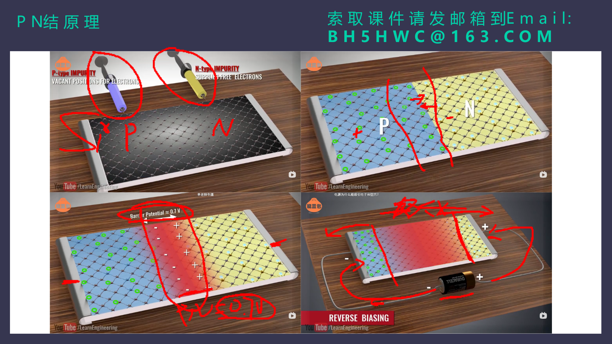
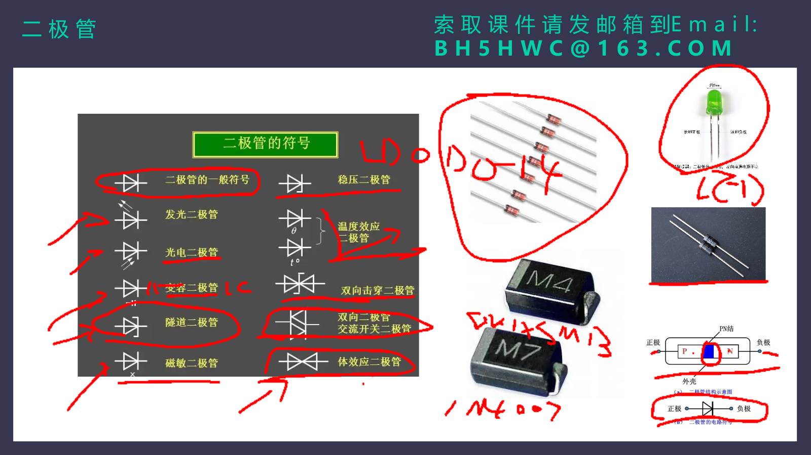
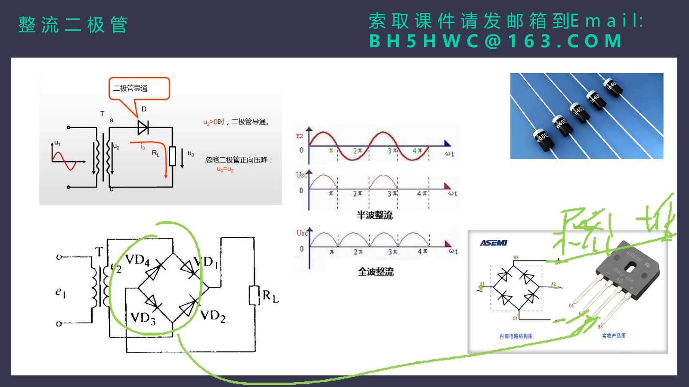
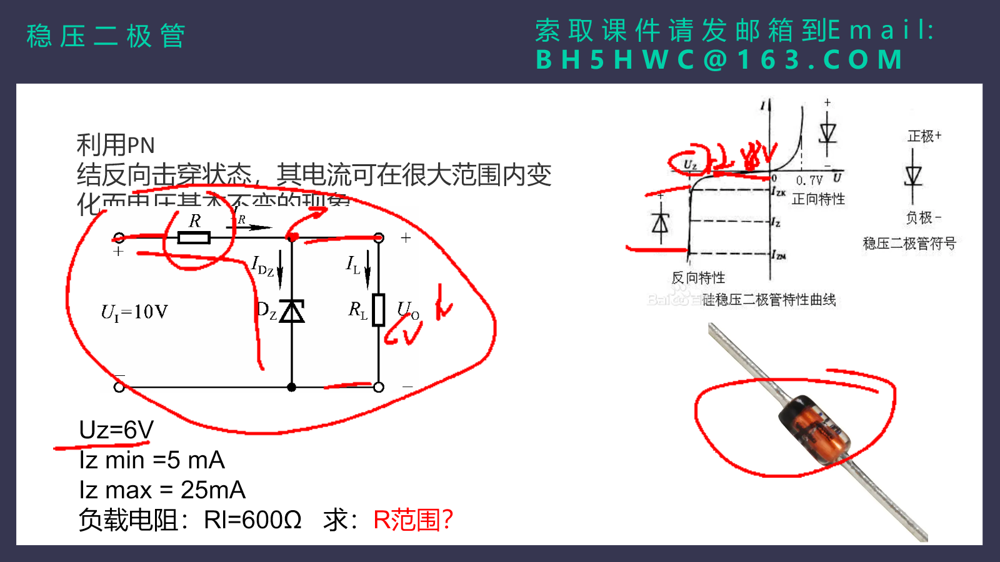

# 第四课时：PN 结与二极管基础知识（1）学习笔记

> 学习来源：`D:/Archive_afeng/硬件学习课件/第四课时-PN结与二极管基础知识(1).pptx`，已核对为第 4 课时，共 22 页。
>
> 本笔记以课件的 PN 结、整流二极管、稳压二极管、肖特基二极管、快恢复二极管、续流二极管和封装内容为主线，补充了本次学习对话中提出的符号极性、交直流、桥式整流、参数解读和稳压计算问题。课件中的“索取课件”文字属于页面附带信息，不属于知识内容，未纳入笔记。
>
> 文中的“扩展”用于标注课件之外、但与当前主题直接相关的工程知识。元件的最终选型、额定值、封装尺寸和引脚定义必须以目标厂家的数据手册为准。

---

## 一、本课学习目标

学完后，应能把下面这条逻辑链说清楚：

```text
掺杂半导体
    ↓
P 型与 N 型接触，形成 PN 结、耗尽层和内建电场
    ↓
正向偏置时势垒降低，反向偏置时势垒升高
    ↓
得到二极管的单向导电特性
    ↓
用于整流、稳压、续流、开关、保护、发光和检测
```

本课最重要的几件事：

1. 能区分 P 区、N 区、阳极 A、阴极 K，以及原理图和实物上的方向标记。
2. 能说明交流和直流的区别，理解二极管如何把交流整流成脉动直流。
3. 能读懂 `IF`、`VR`、`IR`、`VB`、`trr`、`Cj/C0` 等基本参数，不脱离测试条件下结论。
4. 能解释稳压二极管为什么要反向并联、为什么必须有限流电阻。
5. 能完成简单并联稳压电路中限流电阻范围的计算。
6. 能根据应用场景初步选择普通整流、稳压、肖特基、快恢复、TVS/ESD、LED、光电和续流二极管。

---

## 二、课件核心图

### 2.1 PN 结形成和偏置



上图对应课件的 PN 结原理页。图中的课堂红色标注不作为额外结论；本笔记只根据图中能确认的 PN 结、耗尽层和正反向偏置关系展开。

### 2.2 二极管符号、实物与极性



### 2.3 半波整流、全波整流与桥式整流



### 2.4 稳压二极管和计算例题



---

## 三、半导体、P 型、N 型与 PN 结

### 3.1 为什么要掺杂

硅（Si）和锗（Ge）本身是半导体。它们的导电能力介于导体和绝缘体之间，而且会受温度、光照和掺杂影响。

在纯硅晶体中，每个硅原子与周围原子形成共价键。为了获得更容易控制的导电能力，会在硅中加入少量其他元素，这个过程叫做**掺杂**。

| 类型 | 常见掺杂思路 | 多数载流子 | 少数载流子 |
|---|---|---|---|
| N 型半导体 | 加入五价施主杂质，例如磷、砷 | 自由电子 | 空穴 |
| P 型半导体 | 加入三价受主杂质，例如硼 | 空穴 | 自由电子 |

这里的“多数载流子”表示数量相对更多、主导导电的可移动电荷；“少数载流子”仍然存在，只是数量较少。

**容易混淆的点：**P 型并不表示整块材料带正电，N 型也不表示整块材料带负电。两种半导体在整体上都近似电中性；P、N 只是说明哪种可移动载流子占多数。

### 3.2 PN 结怎样形成

把 P 型区与 N 型区制作在同一块半导体基片上，交界区域就是 PN 结。

刚接触时发生扩散：

- N 区自由电子浓度高，电子会向 P 区扩散；
- P 区空穴浓度高，空穴会向 N 区扩散；
- 电子和空穴在交界附近复合，交界附近的可移动载流子变少。

复合后，N 区交界附近留下不能自由移动的正离子，P 区交界附近留下不能自由移动的负离子。这个几乎没有自由载流子的区域叫作：

> **耗尽层**，也叫空间电荷区。

耗尽层中的固定电荷产生内建电场。它会阻碍后续的多数载流子继续扩散，直到“扩散作用”和“电场驱动的漂移作用”达到平衡。

```text
P 区                       耗尽层                       N 区
空穴较多        负的受主离子 | 正的施主离子        电子较多
                 <--- 内建电场方向 ---
```

### 3.3 正向偏置与反向偏置

#### 正向偏置

把电源正极接 P 区，负极接 N 区：

```text
+V  ── P 区 | PN 结 | N 区 ── 0V
             势垒降低、耗尽层变窄
```

外加电场抵消一部分内建电场，电子和空穴更容易越过 PN 结，因此正向电流明显增大。普通硅二极管在常用电流范围内的正向压降常见为约 `0.6 V` 到 `0.8 V`，但它不是固定不变的“开关门槛”，会随电流和温度变化。

#### 反向偏置

把电源正极接 N 区，负极接 P 区：

```text
0V  ── P 区 | PN 结 | N 区 ── +V
             势垒升高、耗尽层变宽
```

外加电场加强内建电场，多数载流子更难通过。正常情况下只有很小的反向电流，称为**反向漏电流**。

反向电压过高时，PN 结进入击穿区，电流会急剧增大。普通二极管通常应避免长期在此状态工作；稳压二极管和 TVS 则专门利用或承受反向击穿特性，但同样必须控制电流和功耗。

### 3.4 阳极 A、阴极 K 与 P/N 的对应关系

对普通单个 PN 二极管：

```text
阳极 A / P 区  ───|>|───  阴极 K / N 区
                           ↑
                      横线一侧是 K
```

结论：

- **P 区 = 阳极 A**；
- **N 区 = 阴极 K**；
- 原理图中带横线的一端是阴极 K；
- 普通轴向二极管实物上，有色环的一端通常也是阴极 K；
- 常规万用表二极管档中，红表笔接 A、黑表笔接 K，普通硅二极管通常显示约 `0.5 V` 到 `0.8 V`，反接常显示 `OL`。

电流方向也要区分：

- **传统电流方向**：A/P 到 K/N；
- **电子运动方向**：N 到 P。

### 3.5 双向器件为什么不能简单分 P/N

双向 TVS、DIAC 等器件的外部功能不等同于“一个有固定 A/K 的普通二极管”。例如本次对话中出现的 `SMF9.0CA`：

- `CA` 表示双向 TVS 版本；
- 对两端瞬态过压都能钳位；
- 外部两端没有固定的阳极 A、阴极 K 供安装时区分。

它的内部可理解为两个方向相反的击穿结构组合，而不是把其中一侧固定叫 P、另一侧固定叫 N。单向 TVS 才有明确方向，保护正电源时通常让**阴极接受保护电源、阳极接地**，使正常工作时处于反向截止。

---

## 四、交流电、直流电与整流

### 4.1 交流电和直流电的区别

| 对比项 | 交流电 AC | 直流电 DC |
|---|---|---|
| 电压极性 | 周期性改变 | 通常固定 |
| 电流方向 | 周期性反向 | 始终保持同一方向 |
| 常见来源 | 电网、交流发电机 | 电池、USB、太阳能电池、整流稳压后的电源 |
| 典型用途 | 输配电、变压器、交流电机 | 芯片、单片机、传感器、电池设备 |

```text
交流电：电压跨过 0 V，上正下负会周期性交替
        /\    /\
0 V ___/  \__/  \___
        \  /  \  /
         \/    \/

直流电：极性不反转；允许有纹波或缓慢变化
        ────────────
```

“直流”不要求电压绝对没有波动。整流后但未滤波的电压方向固定，称为**脉动直流**；它仍然属于直流，只是纹波较大。

### 4.2 为什么同时需要 AC 和 DC

交流和直流分别适合不同场景：

- 交流发电、变压器升降压和常规电网输配电比较成熟方便；提高输电电压可在同一功率下降低电流，从而降低线路损耗。
- 电池和太阳能电池天然输出直流。
- 数字芯片、传感器和大多数控制电路需要固定极性的低压直流。
- 现代电力电子可在 AC 与 DC 之间转换。特定长距离或海底电缆场景也会使用高压直流输电，不能把“交流只适合输电”理解成绝对规律。

一个常见电能路径：

```text
电网交流
   ↓  变压、整流、滤波、稳压
适配器输出直流
   ↓
手机、单片机、传感器等电子电路
```

### 4.3 二极管为什么能整流

普通二极管正向容易导通、反向基本截止。把它串在交流源与负载之间，就能让一个半周通过、另一个半周被阻断。

#### 半波整流

```text
变压器次级 AC ──|>|── RL ──┐
                  D         │
────────────────────────────┘
```

只有一个半周输出到负载。输出方向固定，但每个周期有较长的“空档”，利用率较低。

#### 全波桥式整流

课件中的 `VD1` 至 `VD4` 构成桥式整流。二次侧的两个交流端接到桥的上下端，负载接到桥的直流正、负端。

设二次绕组上端为 A、下端为 B：

- A 相对 B 为正时：`VD1`、`VD3` 导通；
  
  ```text
  A → VD1 → 负载 RL → VD3 → B
  ```

- B 相对 A 为正时：`VD2`、`VD4` 导通；
  
  ```text
  B → VD2 → 负载 RL → VD4 → A
  ```

两个半周中，流过 `RL` 的传统电流方向相同，因此输出为全波脉动直流。

```text
输入正弦：     /\      /\
              /  \    /  \
_____________/    \__/    \____

全波整流后：   /\  /\  /\  /\
              /  \/  \/  \/  \
_____________/                \___
```

若输入频率为 `50 Hz`，全波整流后的纹波频率为 `100 Hz`。桥中每个半周有两只二极管串联导通，因此近似有两份正向压降：

\[
V_{out,peak}\approx V_{2,peak}-2V_F
\]

对没有滤波电容、阻性负载的理想全波整流，平均输出电压近似：

\[
V_{DC}\approx0.9V_{2,rms}
\]

上式没有计入二极管压降和变压器内阻。若后接大滤波电容，输出会更接近峰值 `V_{2,peak}`，同时会出现充电脉冲电流和与负载有关的纹波，不能再直接用 `0.9V_{rms}` 估算。

### 4.4 电源的完整链路

```text
交流输入 → 变压器/隔离 → 桥式整流 → 滤波电容 → 稳压电路 → 直流负载
```

二极管只完成“方向统一”的整流。滤波电容负责降低纹波，线性稳压器或开关电源负责在输入和负载变化时获得更稳定的输出。

**安全提示：**图中变压器隔离后的低压二次侧才适合按这个实验思路学习。市电部分有触电和火灾风险，不能在未隔离、不了解安全规范的情况下直接搭建或测量。

---

## 五、二极管基本参数：看数据手册时到底在看什么

课件列出 `IF`、`VR`、`IR`、`VB`、`fm`、`trr`、`C0` 等参数。最重要的原则是：

> 参数值必须连同测试温度、测试电压、测试电流、脉冲或连续条件一起看。

| 参数 | 含义 | 设计时的实际问题 |
|---|---|---|
| `IF(AV)` | 最大平均正向整流电流 | 长期平均能通过多大电流，散热够不够 |
| `VF` | 正向压降 | 导通时掉多少电压、发多少热 |
| `VR` / `VRWM` / `VRRM` | 允许反向工作或重复峰值反向电压 | 反向耐压是否有余量 |
| `IR` | 反向漏电流 | 反向截止时仍漏多少电，对低功耗和高温是否可接受 |
| `VB` / `VBR` | 击穿电压 | 从哪里开始反向电流急剧增大 |
| `trr` | 反向恢复时间 | 从正向导通变成反向截止需要多久 |
| `Qrr` | 反向恢复电荷 | 开关瞬态中需要抽走多少存储电荷 |
| `Cj` / `C0` | 结电容或零偏结电容 | 高频时会不会形成额外电容负载 |
| `IFSM` | 浪涌正向电流 | 上电、整流充电等短时冲击能否承受 |

### 5.1 最大平均整流电流 `IF(AV)`

这是器件在规定散热条件下、长期允许承受的正向平均电流。它不是“任何温度、任何 PCB、任何散热方式下都能通过的恒定电流”。

二极管发热近似由下式判断：

\[
P_D\approx V_F\times I_F
\]

结温升高后，允许电流通常需要降额。课件展示的降额曲线强调：环境温度越高，连续允许的平均整流电流越低。

### 5.2 反向耐压 `VR`

正常工作时，二极管两端的最大反向电压不能超过数据手册允许值。不同数据手册可能使用：

- `VRRM`：重复峰值反向电压；
- `VRWM`：最大反向工作电压；
- `VR`：某种指定条件下的反向电压。

课件提到“可保守地取击穿电压的一半作为工作电压”，可视为初学时的经验性余量思路，但它不是普遍的数据手册规则。工程上应根据实际浪涌、容差和拓扑，直接选满足 `VRRM/VRWM` 的器件并留余量。

### 5.3 反向漏电流 `IR`

理想二极管反向截止时电流为零，实际器件会有很小的 `IR`。一般来说，在**相同器件类型、相同反向电压和相同温度**下，`IR` 越小，截止性能越好。

但不能脱离条件横向比较。例如：

- 温度升高时，硅 PN 二极管的漏电通常明显上升；
- 肖特基二极管通常比普通硅 PN 二极管漏电更大；
- TVS、稳压二极管和普通整流二极管的测试定义也不同。

课件给出一个温度影响例子：同一系列整流二极管在 `25°C` 与 `100°C` 下允许的反向漏电上限会相差很大。这正是“看条件”的原因。

### 5.4 击穿电压 `VB`

`VB` 或 `VBR` 指反向伏安特性出现急剧上升的区域对应的电压。击穿本身并不必然立刻损坏器件，是否损坏取决于电流、功耗、持续时间和散热：

- 普通整流二极管：通常避免击穿；
- 稳压二极管：在受控电流范围内利用击穿区稳压；
- TVS：用较强的瞬态能量吸收能力钳制浪涌。

### 5.5 最高工作频率 `fm`、反向恢复时间 `trr` 和 `Qrr`

二极管从正向导通切换到反向时，PN 结中储存的少数载流子不能瞬间消失。短时间内会出现反向恢复电流，直到器件重新建立反向截止能力。

```text
正向导通
   ↓
电流过零
   ↓
出现一小段反向恢复电流
   ↓
恢复反向截止
```

`trr` 越小，越适合高频开关。`Qrr` 越小，开关管通常越容易承受较小的反向恢复冲击和损耗。

课件以 `1N4000` 系列说明普通工频整流器件频率能力有限。常见结论是：

- `1N400x` 常用于 `50/60 Hz` 工频整流；
- 开关电源、PWM、变频器等高频硬开关场合，要重点看 `trr` 和 `Qrr`；
- 可改用快恢复、超快恢复或肖特基器件，具体取决于耐压、漏电和成本要求。

### 5.6 结电容 `Cj/C0`

PN 结两侧相当于形成一个很小的电容。反向偏置加大时，耗尽层通常变宽，结电容通常减小。课件展示了“结电容随反向电压增大而下降”的典型趋势。

高频电路中，结电容会导致：

- 信号被额外耦合或旁路；
- 开关瞬态电流增大；
- 上升沿、下降沿变慢；
- 谐振与 EMI 行为变化。

数据手册中的 `C0`、`Cj`、`CJO` 名称不完全统一。它们通常指某个偏置和测试频率条件下的结电容；正向导通时的扩散电容是另一个需要考虑的现象，不能简单把所有电容参数混为一谈。

### 5.7 硅和锗的课件对比

课件给出典型对比：

| 材料 | 开启电压示意 | 常见导通压降范围 | 反向饱和电流趋势 |
|---|---:|---:|---|
| 硅 Si | 约 `0.5 V` | 约 `0.6 V` 到 `0.8 V` | 较小 |
| 锗 Ge | 约 `0.1 V` | 约 `0.1 V` 到 `0.3 V` | 较大 |

这些数值只表示典型直觉，实际正向压降由电流和温度决定。现代通用电路仍以硅器件为主；需要较低压降和较高开关速度时，经常会看到肖特基二极管。

---

## 六、常见二极管类型和使用场景

### 6.1 整流二极管

**作用：**把交流转换为方向固定的脉动直流，常见于线性电源的半波、中心抽头全波、桥式整流。

**重点参数：**`IF(AV)`、`VRRM`、`IFSM`、`VF`、`IR`、`trr`。

**典型器件：**`1N4001` 到 `1N4007` 是常见的 1 A 轴向整流二极管系列。它们的耐压等级不同，实际使用应以所在厂家数据手册为准。

**场景边界：**工频电源可以使用普通整流二极管；数十或数百 kHz 的开关电源整流不能仅因“耐压和电流够”就选 `1N4007`，还必须检查反向恢复损耗。

### 6.2 稳压二极管

**作用：**反向击穿区内，在规定电流范围内维持近似稳定的电压。

**常见场景：**低功耗基准、简单分流稳压、过压钳位、信号限幅。

**必须注意：**串联限流电阻、最小稳压电流、最大稳压电流、最大功耗和温度系数。

### 6.3 肖特基二极管 SBD

肖特基二极管由金属与 N 型半导体的结形成势垒，属于金属-半导体器件。它和普通 PN 二极管的载流子机理不同，因此通常有：

- 正向压降低；
- 开关速度快，几乎没有传统 PN 二极管那样的少数载流子反向恢复；
- 反向漏电相对较大；
- 反向耐压通常较低。

**典型场景：**低压开关电源输出整流、DC-DC 续流、低压电源防反接、电源 OR-ing。

课件提到其耐压通常不高。选用时不能只看低 `VF`，还必须检查高温漏电、反向耐压和反向功耗。

**课件分类表的辨析：**第 7 页中“肖特基二极管”附近列出了“续流、稳压、变容、检波”等词。做基础选型时，不应把这几个词都当作肖特基的标准用途：变容是变容二极管的专门用途，简单稳压主要使用稳压二极管；肖特基因势垒低可用于某些高频检波，但它最常见的用途仍是低压、低损耗、高速整流和续流。

### 6.4 快恢复二极管

它仍是 PN 型二极管，但通过结构和工艺减小反向恢复时间。课件给出的应用包括开关电源、变频器和 PWM 电路。

**典型场景：**耐压要求高、开关频率较高、肖特基耐压或漏电不合适的场合。

**注意：**“快恢复”不等于“所有频率和 EMI 都好”。不同器件的 `trr`、`Qrr`、软恢复特性和反向耐压差别很大。

### 6.5 续流二极管

续流二极管并不是独立材料类别，而是按**电路用途**命名。它和继电器、线圈、电磁阀、电机绕组等电感性负载并联，给关断瞬间的电感电流提供回路。

```text
      +V
       │
     线圈
       │────●──── 开关管 ─── GND
       │    │
       └── A ──|>|── K ── +V
```

上图表达的关键不是 ASCII 符号形状，而是接法：低边开关电路中，续流二极管**阴极 K 接 +V，阳极 A 接线圈与开关管的连接点**。

- 开关导通时，二极管反向截止；
- 开关关断时，线圈试图维持原方向电流，连接点电压上升；
- 二极管导通，线圈电流经二极管回到电源侧，电压被钳在约 `+V + VF` 附近。

这样能保护开关管，但普通二极管的低钳位也会让线圈电流衰减较慢。对继电器释放速度有要求时，可能使用 TVS、稳压二极管或二极管加稳压管的钳位方式，在保护与释放速度之间取折中。

### 6.6 TVS 与 ESD 二极管

**TVS（瞬态电压抑制器）：**吸收或旁路较大瞬态能量，用于电源浪涌、汽车电源脉冲、接口浪涌等。关注 `VRWM`、击穿电压、钳位电压、峰值脉冲功率和波形条件。

**ESD 二极管：**主要用于接口静电保护，通常更强调低结电容和很快的响应，常用于 USB、HDMI、高速数据线和按键接口。

TVS 不等于“稳压二极管的任意替代品”：两者的瞬态功率能力、钳位条件、精度和寄生电容不同。

### 6.7 发光、光电、变容与其他课件图标

| 类型 | 主要特点 | 典型使用场景 |
|---|---|---|
| LED 发光二极管 | 正向导通时发光 | 指示灯、照明、显示、红外发射、光耦 |
| 光电二极管 | 光照产生光电流，常反向偏置 | 编码器、光电开关、光纤接收、亮度检测 |
| 变容二极管 | 反向偏置下结电容随电压变 | VCO、PLL、射频调谐、FM 调制 |
| 双向击穿器件 | 两个方向可钳位或击穿 | 交流/双向瞬态保护，具体看型号 |
| DIAC 双向触发器件 | 达到双向触发电压后导通 | 交流调光、TRIAC 触发 |

课件图中也列出了温敏、磁敏、隧道、体效应等专用二极管。这些器件需要结合更具体的物理机理和应用电路学习，初学阶段应先把“普通 PN、整流、稳压、肖特基、快恢复、保护和续流”掌握扎实。

---

## 七、稳压二极管：原理、接法与例题

### 7.1 最重要的应用特点

> 稳压二极管工作在反向击穿区。在规定的电流范围内，电流改变较大时，两端电压只改变较小，因此可以把节点电压钳位在接近 `UZ` 的范围。

最常见的是**并联型稳压**：稳压管与负载并联，二者共同接在输出节点与地之间；电源前面串联一个限流电阻。

```text
Ui ── R ──●── RL ── GND
          │
          └── K 稳压二极管 A ── GND
```

画图时，稳压二极管符号中具有折线的横线一侧仍是阴极 K。为了让它工作在反向击穿区，正输出节点接 K，地接 A。

节点电流关系：

\[
I_R=I_Z+I_L
\]

其中：

- `I_R`：串联限流电阻中的电流；
- `IZ`：稳压二极管电流；
- `IL`：负载电流。

这里的 `I_R` 下标是 resistor，表示“电阻电流”；它和数据手册参数 `IR`（reverse leakage current，反向漏电流）只是字母相同，含义不同。下面的计算均把 `I_R` 作为串联电阻电流。

### 7.2 为什么必须有串联限流电阻

稳压管进入击穿后并不会自动把电流限制在安全值。若直接把它接在足够强的直流电源上，电流可能急剧增大，导致功耗超限、器件损坏。

串联电阻承担两个任务：

1. 把多余电压 `Ui - Uz` 降在自身两端；
2. 限制进入稳压管和负载节点的总电流。

### 7.3 关键参数的正确理解

| 参数 | 含义 | 设计意义 |
|---|---|---|
| `UZ` / `VZ` | 规定测试电流下的稳压值 | 输出大致钳位到哪里 |
| `IZT` | 测试稳压值时的电流 | `UZ` 通常在这个点给出 |
| `IZK` / `IZ(min)` | 膝点电流或最小工作电流 | 小于它时稳压效果变差 |
| `IZM` / `IZ(max)` | 最大允许稳压电流 | 超过后可能功耗过大 |
| `ZZ` / `RZ` | 动态电阻 | 电流变化造成的电压变化量 |
| `PZ(max)` | 最大允许功耗 | 近似检查 `UZ × IZ` 是否超限 |
| 温度系数 | 温度变化引起的稳压值变化 | 精密参考和宽温应用必须考虑 |

**课件术语修正：**课件第 13 页将 `IZ` 写作“反向漏电电流”容易误解。通常 `IZ` 指击穿稳压区的工作电流；`IR` 才常用于表示低于击穿电压时的反向漏电流。阅读具体数据手册时应看符号旁的测试条件。

### 7.4 课件例题：求 R 的范围

已知：

\[
U_i=10V,
\quad U_Z=6V,
\quad I_{Z(min)}=5mA,
\quad I_{Z(max)}=25mA,
\quad R_L=600\Omega
\]

#### 第一步：稳压时负载两端电压是多少

稳压管和 `RL` 并联，所以两端电压相同：

\[
U_L\approx U_Z=6V
\]

这就是先前问题中“为什么负载两端电压约为 `UZ=6V`”的原因。并联元件共享同一对节点，因此电压相同。

#### 第二步：计算负载电流 `IL`

根据欧姆定律：

\[
I_L=\frac{U_L}{R_L}=\frac{6V}{600\Omega}=0.01A=10mA
\]

含义是：当输出被稳在约 `6V` 时，600 Ω 的负载会取走 10 mA 电流。

#### 第三步：把稳压管电流范围换成串联电阻电流范围

因为：

\[
I_R=I_Z+I_L
\]

要保持稳压，`IZ` 必须在 `5 mA` 到 `25 mA` 内。因此：

\[
I_{R(min)}=I_{Z(min)}+I_L=5mA+10mA=15mA
\]

\[
I_{R(max)}=I_{Z(max)}+I_L=25mA+10mA=35mA
\]

#### 第四步：计算电阻范围

限流电阻两端电压为：

\[
U_R=U_i-U_Z=10V-6V=4V
\]

电阻满足：

\[
R=\frac{U_R}{I_R}
\]

注意：电流越大，允许的 R 越小。

当 `IR=35 mA` 时，R 最小：

\[
R_{min}=\frac{4V}{35mA}\approx114.3\Omega
\]

当 `IR=15 mA` 时，R 最大：

\[
R_{max}=\frac{4V}{15mA}\approx266.7\Omega
\]

所以，在题目给定输入电压和固定 600 Ω 负载的条件下：

\[
\boxed{114.3\Omega\le R\le266.7\Omega}
\]

例如取 `180 Ω`：

\[
I_R=\frac{4V}{180\Omega}\approx22.2mA
\]

\[
I_Z=I_R-I_L\approx22.2mA-10mA=12.2mA
\]

满足 `5mA≤IZ≤25mA`。

此时：

\[
P_R=\frac{U_R^2}{R}=\frac{4^2}{180}\approx0.089W
\]

选择 `1/4 W` 电阻有余量。稳压管在题设最大 `IZ=25mA` 时的功耗为：

\[
P_{Z(max)}=U_Z\times I_{Z(max)}=6V\times25mA=0.15W
\]

因此额定功率至少要高于 `0.15 W`，实际应留温升和电源容差余量。

### 7.5 例题中隐藏的工程条件

上面的 `114.3 Ω` 下限只在负载恒为 `600 Ω` 时成立。如果负载断开，`IL=0`，那么取 `114.3 Ω` 时：

\[
I_Z=\frac{10V-6V}{114.3\Omega}\approx35mA
\]

这已经超过题设 `IZ(max)=25mA`。所以实际设计应把负载范围也列入最坏情况。

通用近似检查思路：

```text
输入电压最低、负载电流最大：检查 IZ 是否仍 ≥ IZ(min)
输入电压最高、负载电流最小：检查 IZ 是否仍 ≤ IZ(max)
```

再结合 `UZ` 的最小/最大公差、温度和电阻容差，分别推导 `Rmax` 与 `Rmin`。这比只代一个标称输入电压更接近真实工程。

---

## 八、二极管封装命名与实物识别

### 8.1 型号和封装不是一回事

| 名称示例 | 它表示什么 |
|---|---|
| `1N4007`、`SS14`、`BZT52C5V1` | 器件型号或型号系列 |
| `DO-35`、`DO-41`、`SOD-123`、`SMA` | 封装/外形系列 |

封装描述的是外形、尺寸、端子形式和散热条件，不能单独决定二极管功能。不同厂家可能把相近电气规格做在不同封装中，同一型号系列也可能提供多个封装版本。

### 8.2 课件列举的封装

课件提到玻璃、金属、塑料封装，并列出：`DO-15`、`DO-41`、`DO-27`、`SOD-323`、`SOD-523`、`SOD-723`、`SOT-23`、`SOT-323`、`SOT-523` 等。

可先用下面的直觉分类：

| 封装类别 | 常见形态 | 例子 | 常见场景 |
|---|---|---|---|
| 轴向插件 | 两端引脚、圆柱管体 | `DO-35`、`DO-41`、`DO-201` | 通孔整流、维修、较大功率 |
| 小型贴片二极管 | 两端贴片 | `SOD-323`、`SOD-523`、`SOD-123` | 信号、稳压、低功耗保护 |
| 贴片功率二极管 | 较大两端贴片 | `SMA`、`SMB`、`SMC` | TVS、肖特基、整流 |
| 多引脚小外壳 | 3 引脚或更多 | `SOT-23`、`SOT-323` | 双二极管、ESD 阵列、带公共端器件 |

`DO`、`SOD`、`SOT` 的数字或后缀不是简单的“数字越大，电流一定越大”规律。看封装时，最终应从数据手册核对：机械尺寸图、推荐焊盘、引脚编号、极性标记、热阻和额定值。

### 8.3 实物方向怎么确认

对普通单向二极管：

- 轴向管的色环通常标示阴极 K；
- 贴片管外壳上的色带、横线或凹点通常对应阴极 K；
- LED 长脚通常是阳极、短脚通常是阴极，外壳平边常靠近阴极，但剪脚或封装特殊时应再查数据手册；
- 有些双向 TVS、DIAC 没有安装方向，不能强行按 K 色带规则判断。

仅凭 PCB 丝印形状、网图或器件代码猜方向风险很高。装配前应以原理图引脚号、PCB 封装 `pad 1`、制造商封装图三者互相校验。

---

## 九、从需求到选型：一个基础检查表

### 9.1 工频桥式整流

先确认：

1. 次级有效值电压和最高输入容差；
2. 负载平均电流与上电浪涌；
3. 是否有大滤波电容，是否会产生充电脉冲；
4. 反向耐压、平均电流、浪涌电流和温升；
5. 需要普通整流、快恢复还是肖特基。

### 9.2 继电器或线圈续流

先确认：

1. 线圈电流和工作电压；
2. 开关频率；
3. 希望继电器释放得快还是优先降低开关管电压；
4. 二极管的反向耐压、正向浪涌能力与封装散热；
5. PCB 上二极管是否靠近线圈或开关回路，避免大环路辐射。

### 9.3 接口和电源浪涌保护

先确认：

1. 正常工作电压，即 `VRWM` 不能太低；
2. 允许的被保护芯片最高电压，即 TVS 的钳位电压不能太高；
3. 浪涌标准和能量；
4. 信号速率和允许电容；
5. TVS 到接口、地回流路径是否足够短和低电感。

---

## 十、本次对话问题整理

### 10.1 “阴极 N，阳极 P？”

对普通单个 PN 二极管，答案是对的：

```text
阳极 A = P 区
阴极 K = N 区
```

原理图有横线的一端为阴极 K。双向 TVS、DIAC 等不适用这个简单外部极性规则。

### 10.2 “交流变直流：普通二极管是什么意思？”

二极管并不是把交流直接变成完全平滑的直流，而是先利用单向导电性把两个方向交替的交流变成单一方向的**脉动直流**。滤波和稳压电路再进一步降低波动。

### 10.3 “交流电和直流电有什么区别？”

关键看极性与电流方向是否周期性反转：交流会反转，直流不反转。直流可以有纹波，仍然属于直流。

### 10.4 “为什么要有交流和直流两种电源形式？”

交流便于传统发电、变压器变压和电网使用；直流适合电池、芯片和电子控制。电力电子负责在两者之间高效转换。

### 10.5 “普通二极管、稳压二极管、TVS 的边界？”

| 器件 | 主要目标 | 正常工作区域 |
|---|---|---|
| 普通整流二极管 | 整流、反接保护、续流 | 正向导通或反向截止，通常避免击穿 |
| 稳压二极管 | 参考、简单稳压、限幅 | 受控的反向击穿区 |
| TVS | 快速吸收浪涌/ESD | 正常截止，瞬态时进入钳位/击穿 |

### 10.6 “并联稳压题里 `IL=UZ/RL` 是什么意思？”

稳压二极管与负载 `RL` 并联，所以 `RL` 两端电压约等于 `UZ`。再对 `RL` 用欧姆定律，就能得到负载电流：

\[
I_L=\frac{U_Z}{R_L}
\]

不是把 `UZ` 当成“电阻上的额外电压”，而是并联节点本来就共享同一个输出电压。

---

## 十一、常见误区

1. **把 P 型理解为整个材料带正电。**P/N 说明多数载流子类型，材料整体仍近似电中性。
2. **把 `0.7 V` 当成硅二极管永远固定的开启电压。**它随电流、温度、器件类型变化。
3. **只按左右判断 A/K。**应看符号横线、器件色环和数据手册，符号旋转后左右关系会变。
4. **把普通单向二极管的极性规则套到双向 TVS。**双向器件没有固定外部 A/K 安装方向。
5. **认为整流后立刻就是稳定直流。**整流后通常是脉动直流，仍需要滤波和稳压。
6. **只看电流额定值选整流管。**还要看耐压、浪涌、反向恢复、功耗与散热。
7. **把 `IZ` 和 `IR` 当成同一个量。**稳压区工作电流与击穿前反向漏电流含义不同。
8. **稳压管直接跨接电源且不加限流。**会因过流和过功耗损坏。
9. **用固定负载的计算结果覆盖负载开路情形。**负载变轻时，更多电流会流进稳压管。
10. **仅凭封装名推断所有电气能力。**封装与额定值相关，但具体数值必须回到数据手册。

---

## 十二、动手验证建议

### 12.1 用万用表识别普通二极管方向

1. 断电，最好把二极管至少抬起一脚，避免并联支路影响读数。
2. 万用表切到二极管档。
3. 红表笔接一端、黑表笔接另一端。
4. 出现普通硅 PN 结典型正向压降时，红表笔一端是 A/P，黑表笔一端是 K/N。
5. 对调表笔后应接近 `OL` 或无穷大。

不要把万用表二极管档用于判断高压 TVS 的实际击穿电压，也不要在带电电路上切换到电阻或二极管档测量。

### 12.2 观察桥式整流波形

在隔离、低压交流源条件下，使用示波器分别观察：

- 变压器二次侧：正负交替的交流；
- 桥式整流后无电容：全波脉动直流；
- 加滤波电容后：平均电压升高、纹波降低。

可尝试改变负载电阻。负载越重，滤波电容放电越快，纹波通常越大。

### 12.3 验证稳压二极管

使用限流电源或串联电阻，缓慢提高反向电压，测量稳压管两端电压和电流。观察：

- 未到击穿区前，电流较小；
- 接近稳压区后，电流增大而电压变化较慢；
- 电流太小会稳不住，太大则功耗危险。

务必先按 `P=VI` 计算限流和功率，避免直接把稳压管跨接在低阻抗电源上。

---

## 十三、自测题

1. 对普通 PN 二极管，P 区对应阳极还是阴极？原理图中的横线对应哪一极？
2. P 型半导体是不是整体带正电？
3. PN 结的耗尽层为什么会形成？它对继续扩散起什么作用？
4. 正向偏置和反向偏置分别如何连接电源？耗尽层如何变化？
5. `1N4007` 能否仅凭“1 A、耐压高”就直接用在 100 kHz 开关整流中？还缺少什么判断？
6. 全波桥式整流中，为什么负载电流在两个半周方向相同？
7. 稳压二极管为什么必须串联限流电阻？
8. 例题中 `UZ=6V`、`RL=600Ω`，负载电流是多少？
9. 例题中如果负载断开，原先根据固定 600 Ω 负载得到的最小 R 还一定安全吗？为什么？
10. `SMF9.0CA` 是否应按“有色环的一端为阴极”的普通单向二极管规则安装？

### 参考答案

1. P 区对应阳极 A，N 区对应阴极 K；原理图横线一侧为 K。
2. 不是。P/N 指多数载流子种类，材料整体近似电中性。
3. 电子和空穴在交界处扩散、复合，留下固定离子，形成耗尽层和内建电场；内建电场抑制继续扩散。
4. 正向偏置为 P 接正、N 接负，耗尽层变窄；反向偏置为 P 接负、N 接正，耗尽层变宽。
5. 不能。还要看 `trr`、`Qrr`、开关损耗、EMI、温升和实际拓扑。
6. 每个半周各有一对对角二极管导通，它们都把电流导向负载的同一端。
7. 击穿区本身不限制到安全电流，限流电阻用来限制电流和功耗。
8. `IL=UZ/RL=6/600=10mA`。
9. 不一定。负载断开时 `IL` 变为 0，原先流向负载的电流会转而流入稳压管，`IZ` 可能超过最大值。
10. 不应。`CA` 表示双向 TVS 版本，外部通常没有固定 A/K 安装方向；仍要确认具体数据手册和封装说明。

---

## 十四、一页复习卡

```text
PN 结：P 型和 N 型接触，扩散与复合形成耗尽层和内建电场。

普通二极管：P = A，N = K；横线/色环侧通常是 K。

正偏：P 接正、N 接负，导通。
反偏：P 接负、N 接正，截止；电压过高会击穿。

AC：极性周期反转。
DC：极性不反转，可带纹波。

桥式整流：两个半周都利用，每次两只二极管导通。

IF：平均正向电流。
VR：反向耐压。
IR：反向漏电流。
trr/Qrr：高频开关是否合适。
Cj：高频下的结电容影响。

稳压管：反向并联，必须串联限流电阻。
IR = IZ + IL；并联时 UL ≈ UZ。

普通整流：工频整流。
肖特基：低 VF、高速、漏电较大、耐压常较低。
快恢复：高频 PN 整流。
续流管：给线圈关断电流提供回路。
TVS/ESD：浪涌和静电保护。

封装名不是型号，也不能单独决定电流、耐压和极性。
```

---

## 十五、下一步建议

后续学习可按下面顺序推进：

1. 用万用表实际测一只 `1N4148`、`1N4007` 或 LED 的正反向特性；
2. 画出半波、桥式整流和“桥式整流加滤波电容”三种电路，并对比波形；
3. 练习使用 `VIN(min/max)`、`IL(min/max)` 重新计算稳压电阻范围；
4. 读一份具体二极管数据手册，找到 `VRRM`、`IF(AV)`、`VF`、`IR`、`trr`、封装图和降额曲线；
5. 在继电器或电磁阀驱动电路中，分析续流二极管方向和关断瞬态。
