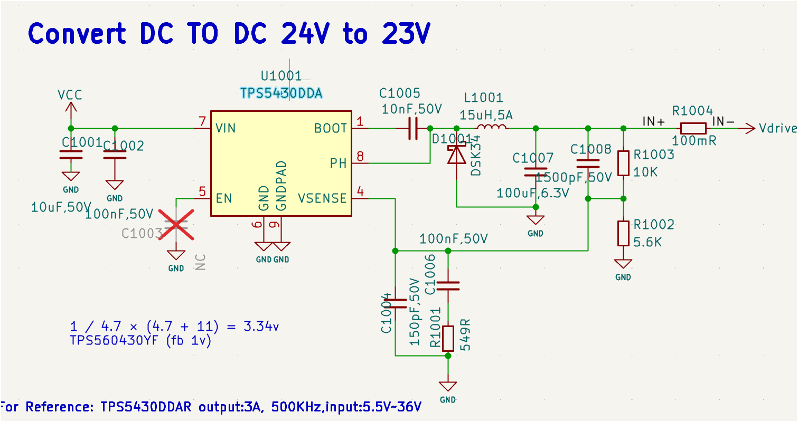
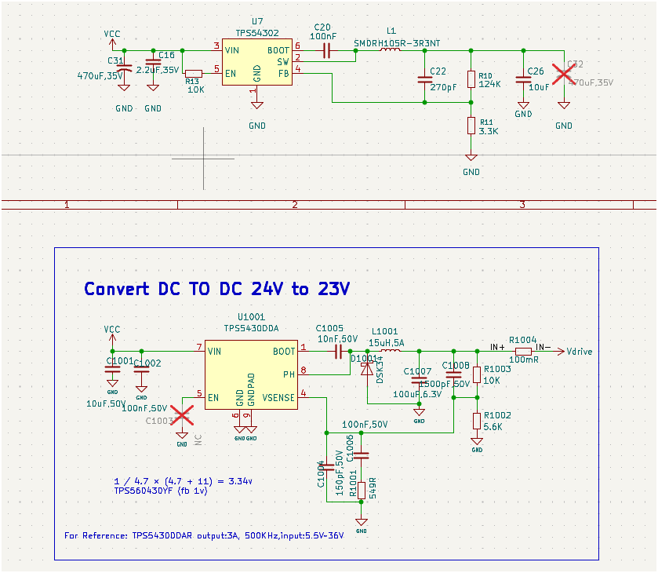
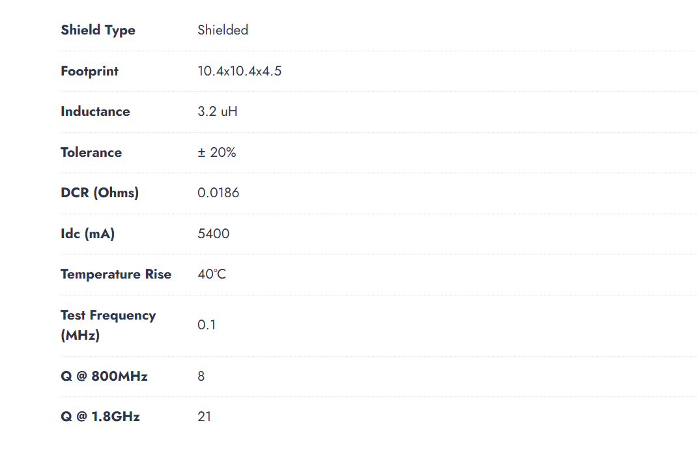
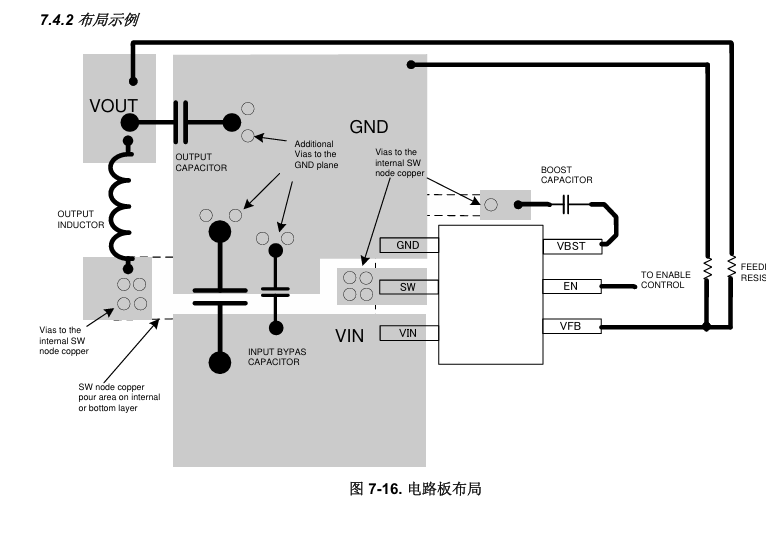

原始整理日期：2026-07-16

## 1. 文档目的

本文整理 TPS54302DDCR 替换 TPS5430DDA 的设计过程，包括：

- 24 V 输入、约 23 V 输出的反馈计算。
- TPS54302 外围元件推荐值。
- TPS5430DDA、TPS54302DDCR、TPS560430YF 三种芯片的选型对比。
- 前馈电容 C22 的作用与选型。
- 电感 Idc、Isat、DCR 和纹波电流分析。
- TPS54302 手册布局实例的识读方法。
- 参考手册实例，在 PCB 中摆放 U7、输入电容、BOOT 电容、电感、输出电容和反馈网络的方法。
- 对话中的主要提问与对应结论。

参考资料：

- TPS54302 数据手册：`D:\project_afeng\A303\tps54302.pdf`
- KiCad 电源原理图：`D:\project_afeng\A303\Kicad 10_project\a303-driver\power.kicad_sch`

> 设计条件：VIN 标称 24 V，芯片建议工作范围最大 28 V，VOUT 约 23 V，开关频率 400 kHz，目标负载最高 3 A。

## 2. 原电路与替换目标

原 TPS5430DDA 电路如下。



TPS54302DDCR 不能直接替换 TPS5430DDA：

- TPS54302 是 DDC/SOT-23-6 封装，TPS5430DDA 是 DDA/PowerPAD 封装。
- 两者引脚编号和功能排列不同。
- TPS54302 内置同步低侧 MOSFET，不需要外部续流肖特基二极管。
- TPS54302 使用内部环路补偿，不应沿用 TPS5430 的外部补偿网络。
- TPS54302 的反馈基准典型值是 0.596 V。

当前 TPS54302 原理图阶段如下。



这张图还需要按本文的最终推荐值修改，尤其是输入电容、电感、输出电容和 EN 接法。

## 3. TPS54302 引脚

DDC/SOT-23-6 顶视图引脚如下：

```text
        TPS54302
   +----------------+
1  | GND        BOOT| 6
2  | SW           EN| 5
3  | VIN          FB| 4
   +----------------+
```

| 引脚 | 名称 | 连接要求 |
|---:|---|---|
| 1 | GND | 功率地和控制地，反馈地在此处做开尔文连接 |
| 2 | SW | 接电感输入端和 BOOT 电容的 SW 端 |
| 3 | VIN | 接 24 V 输入及输入陶瓷电容 |
| 4 | FB | 接反馈分压中点 |
| 5 | EN | 悬空默认启用，或由开漏信号控制 |
| 6 | BOOT | 通过 100 nF 电容连接 SW |

EN 推荐电压最大为 5.5 V，绝对最大为 7 V，禁止使用电阻将 EN 直接上拉到 24 V。

## 4. 推荐最终元件值

| 原理图编号 | 推荐值 | 说明 |
|---|---:|---|
| U7 | TPS54302DDCR | DDC/SOT-23-6 |
| C31 | 470 uF/35 V 或 50 V | 输入大容量电解；如果 24 V 总线有浪涌，优先 50 V |
| C16 | 22 uF/50 V，X7R | 输入陶瓷电容；确保 24 V 偏压后有效电容不低于约 10 uF |
| 新增 CIN-HF | 100 nF/50 V，X7R | 紧贴 VIN 和 GND，与 C16 并联 |
| C20 | 100 nF/16 V 或 25 V，X7R | BOOT-SW 自举电容 |
| L1 | 15 uH | Isat >= 5 A，Idc >= 3.5 A，DCR <= 30 至 40 mOhm，屏蔽型 |
| R10 | 124 kOhm，1% 或 0.1% | VOUT 到 FB 的上反馈电阻 |
| R11 | 3.3 kOhm，1% 或 0.1% | FB 到 GND 的下反馈电阻 |
| C22 | 270 pF/50 V，C0G/NP0 | 并联在 R10 两端的前馈电容 |
| C26 | 22 uF/50 V，X7R | 输出陶瓷电容；当前 10 uF/0402 需修改 |
| 新增 COUT2 | 22 uF/50 V，X7R | 与 C26 并联；当前工程的 C27 属于另一电源电路 |
| 最新图中的 R13 | DNP/删除 | 它把 24 V 上拉到 EN，接法不允许 |

如果需要输出断电泄放，可另外增加 `RBLEED = 100 kOhm/0.25 W`。这个泄放电阻不是芯片正常稳压所必需的。

## 5. 输出电压公式

### 提问

> 该芯片的降压公式是什么？24 V 降到 23 V 如何选择反馈电阻？

### 回答

TPS54302 的直流输出电压由反馈分压器决定：

```text
VOUT = VFB x (1 + R10/R11)
```

其中 TPS54302 的典型反馈基准为：

```text
VFB = 0.596 V
```

采用常用标准值：

```text
R10 = 124 kOhm
R11 = 3.3 kOhm
```

输出电压为：

```text
VOUT = 0.596 x (1 + 124/3.3)
     = 22.99 V
```

可在原理图中添加以下说明：

```text
VOUT = 0.596 x (1 + 124k/3.3k) = 22.99 V

TPS54302DDCR
VIN: 4.5 V to 28 V
VOUT: 23 V nominal
IOUT: 3 A maximum IC rating
fSW: 400 kHz
```

理想 Buck 的占空比关系为：

```text
D approximately equals VOUT/VIN = 23/24 = 95.83%
```

实际占空比还需要补偿 MOSFET、电感 DCR、PCB 和采样电阻压降。

## 6. 反馈电阻的其他选择

### 提问

> 2.66 kOhm 不好采购，R10/R11 是否有更普遍的阻值？

### 回答

| R10 | R11 | 标称输出 | C22 建议 |
|---:|---:|---:|---:|
| 124 kOhm | 3.3 kOhm | 22.99 V | 270 pF |
| 75 kOhm | 2.0 kOhm | 22.95 V | 430 pF |
| 100 kOhm | 2.7 kOhm 并联 180 kOhm | 23.01 V | 330 pF |

推荐使用 `124 kOhm/3.3 kOhm`。3.3 kOhm 很常见，124 kOhm 是标准 E96 阻值。

手册给出的 FB 基准范围约为 0.581 V 至 0.611 V，因此芯片自身基准误差大于上述几十毫伏的电阻组合差异。

## 7. C22 的作用

### 提问

> C22 对输出电压有什么作用？为什么改变 R10 后也要改变 C22？

### 回答

C22 是并联在 R10 两端的前馈电容 CFF。

- 直流时电容开路，因此 C22 不决定直流输出电压。
- 负载快速变化时，C22 将 VOUT 的高频变化前馈到 FB。
- 它用于改善相位裕度、负载瞬态响应、输出跌落和过冲。

C22 与 R10 形成补偿零点：

```text
fZ approximately equals 1/(2 x pi x R10 x C22)
```

改变 R10 后，需要相应改变 C22，以保持 `R10 x C22` 大致不变：

| R10 | C22 | R10 x C22 | 零点约值 |
|---:|---:|---:|---:|
| 75 kOhm | 430 pF | 32.25 us | 4.94 kHz |
| 100 kOhm | 330 pF | 33.0 us | 4.82 kHz |
| 124 kOhm | 270 pF | 33.48 us | 4.75 kHz |

当前采用 `R10=124 kOhm`，因此 C22 推荐 `270 pF/C0G`。PCB 应保留该位置，样机阶段可在 220 pF 至 330 pF 范围内结合负载阶跃波形调整。

## 8. R13 的两种不同含义

### 提问

> R13 有什么作用，实际设计中可以不要吗？

### 回答与澄清

早期示意图中的 R13 位于输出与 GND 之间，是输出泄放/假负载电阻：

- TPS54302 支持轻载脉冲跳跃，不需要假负载才能稳压。
- 没有明确放电时间要求时可以 DNP。
- 如果需要断电泄放，可以使用 100 kOhm；若需要更快放电，可根据功耗选择 10 kOhm/0.25 W。

但最新原理图中的 R13 位于 VCC 与 EN 之间，是 EN 上拉电阻。它会把 EN 拉向 24 V，超过 EN 引脚允许电压，必须删除或重新设计分压。最简单、安全的做法是：

```text
R13 = DNP
EN = 悬空，芯片默认启用
```

## 9. 电感参数和 Idc 分析

### 提问

> 电感的 Idc 是什么？图中电感参数是否适合？



### 回答

图中电感主要参数为：

| 参数 | 数值 | 含义 |
|---|---:|---|
| Inductance | 3.2 uH | 小信号电感量 |
| Tolerance | +/-20% | 初始值可能低至 2.56 uH |
| DCR | 18.6 mOhm | 绕组直流电阻 |
| Idc | 5.4 A | 通常是温升达到 40 C 时的热额定电流 |
| Temperature Rise | 40 C | Idc 的温升判据 |
| Isat | 未给出 | 无法确认磁芯饱和能力 |

Idc 不等于 Isat：

- Idc 主要受绕组温升限制。
- Isat 表示直流偏置增大后，磁芯使电感量下降到规定比例时的电流。
- 电源设计需要同时满足 Idc 和 Isat。

3 A 直流下，DCR 导致：

```text
VDCR = 3 x 0.0186 = 55.8 mV
PDC = 3^2 x 0.0186 = 0.167 W
```

24 V 输入、23 V 输出、3.2 uH、400 kHz 时：

```text
Delta IL = VOUT x (VIN - VOUT)/(VIN x L x fSW)
         = 23 x (24 - 23)/(24 x 3.2 uH x 400 kHz)
         = 0.75 A

IL_PEAK = 3 + 0.75/2 = 3.38 A
```

输入升到 28 V 时：

```text
Delta IL = 23 x (28 - 23)/(28 x 3.2 uH x 400 kHz)
         = 3.21 A

IL_PEAK = 3 + 3.21/2 = 4.60 A
```

TPS54302 高侧限流最小值约为 4 A，因此 3.2 uH 在 28 V、3 A 条件下存在触发限流的风险。考虑 -20% 电感容差后风险更高。

最终推荐：

```text
L1 = 15 uH
Isat >= 5 A
Idc >= 3.5 A
DCR <= 30 to 40 mOhm
Shielded power inductor
```

15 uH 在 28 V 输入、3 A 输出时，纹波约 0.68 A，峰值约 3.34 A，裕量明显更好。

## 10. 24 V 转 23 V 的压差风险

TPS54302 在 BOOT-SW 电压足够时支持 100% 占空比，但 24 V 到 23 V 只有 1 V 压差。满载和高温时可近似估算：

```text
VIN_MIN approximately equals VOUT
          + IOUT x (RDS_ON_HS + DCR_L + RSHUNT + PCB resistance)
```

如果高温高侧 MOSFET 按约 0.20 Ohm、电感 DCR 按 0.03 Ohm、外部采样电阻按 0.10 Ohm 估算：

```text
Voltage drop approximately equals 3 x (0.20 + 0.03 + 0.10)
                         approximately equals 0.99 V
```

这几乎耗尽全部 1 V 压差。因此：

- 不能把“芯片额定 3 A”理解为 24 V 输入下全温度保证 23 V/3 A。
- 如果存在 100 mOhm 输出采样电阻，3 A 时还会产生 0.3 V 压降和 0.9 W 功耗。
- 推荐降低采样电阻，或提高最低输入电压、降低输出设定值。
- 若要求 24 V 输入容差范围内严格维持 23 V/3 A，应考虑升降压架构。

## 11. 手册 PCB 布局实例



### 图例识读

| 图中元素 | 含义 |
|---|---|
| 粗黑线 | 顶层关键走线或电流路径 |
| 灰色区域 | 铜皮、电源区域或 GND 区域 |
| 空心圆 | 过孔 |
| 虚线 | 通过过孔连接到内层或底层 |
| VBST | BOOT 引脚 |
| VFB | FB 引脚 |

此图不是实际比例图，不能按外形尺寸照抄。它表达的是元件相对位置和关键回路关系。

## 12. 完全参考手册实例的元件摆放

### 12.1 摆放顺序

1. 先放 U7，并确认封装 1 脚方向。
2. 在 VIN/GND 一侧贴放 C16 和 100 nF 高频输入电容。
3. 在 BOOT 一侧贴放 C20，使其直接跨接 BOOT 和 SW。
4. 在 SW 一侧紧贴 U7 放 L1，L1 的 SW 端焊盘朝向 U7。
5. 在 L1 的 VOUT 端紧贴放置 C26 和新增 COUT2。
6. 在 FB 一侧放置 R10、R11、C22，远离 SW 和 L1。
7. C31 放在输入接口与 C16 之间，可以比 C16 离 U7 稍远。

### 12.2 推荐相对位置

```text
                     VOUT connector
                           |
                       C26 / COUT2
                           |
                          L1
                           |
                         SW node
                           |
Input connector--C31--C16--[ U7 TPS54302 ]--R10/R11/C22
                      |     [            ]       |
                     GND    [            ]      FB side
                                      C20 near BOOT/SW
```

更接近手册图方向的俯视示意：

```text
 VOUT       C26/COUT2
   |           |
   +--- L1 ----+---- GND plane
        |
      SW vias       +-------------+       C20
        +-----------| SW      BOOT|-------||---SW
 C16 + 100 nF ------| VIN       FB|---R10/R11/C22
        |           | GND       EN|---floating/control
       GND          +-------------+
 C31 near input connector
```

## 13. 每个器件在 PCB 上的具体要求

### U7

- 放在功率级中心。
- 确认 GND/SW/VIN 和 BOOT/EN/FB 两侧方向。
- 不允许高 di/dt 开关电流从芯片下方穿过。

### C16 和 100 nF 输入电容

- 必须是距离 U7 最近的输入元件。
- 正端直接、短而宽地连接 VIN 3 脚。
- 负端直接连接 GND 1 脚及 GND 平面。
- 尽量不使用过孔。

关键输入高频环路：

```text
CIN positive -> VIN -> internal MOSFETs -> GND -> CIN negative
```

该环路面积必须最小。

### C20

- 紧贴 BOOT 6 脚。
- 一端接 BOOT，一端接 SW。
- 两端走线均需极短，不能放到电感输出侧。

### L1

- 紧贴 SW 2 脚放置。
- SW 侧焊盘朝向 U7。
- SW 至 L1 的铜皮短而宽，但面积不能无谓扩大。
- L1 远离反馈网络，并禁止 FB 走线从电感下方通过。

### C26、COUT2

- 紧贴 L1 的 VOUT 端。
- 正端接 VOUT 宽铜皮。
- 负端使用短、宽连接进入 GND 平面。
- 负端附近增加多个 GND 过孔。

### R10、R11、C22

- 放在 U7 的 FB 4 脚一侧。
- R11 和 C22 尽量靠近 FB。
- R10 与 C22 并联。
- VOUT 取样线从 C26/C27 正端单独引出，不从 L1 焊盘或大电流路径中间取样。
- R11 地端开尔文连接到 U7 GND 附近的安静地。
- FB 走线远离 SW、BOOT 和 L1，且铜皮面积尽可能小。

### C31

- 靠近输入接口。
- 位于输入接口与 C16 之间。
- 它负责低频储能，不能代替贴近芯片的 C16 和 100 nF 高频旁路。

## 14. 铜皮、过孔和层叠

建议至少使用两层板：

```text
Top: U7、C16、C20、L1、C26/C27、反馈网络和主要功率走线
Bottom 或 Layer 2: 连续完整 GND 平面
```

GND 过孔优先放在：

- U7 GND 引脚附近。
- C16 和 100 nF 的负端附近。
- C26、COUT2 的负端附近。
- GND 铜皮需要换层的位置。

SW 过孔不是 GND 过孔。若按照手册将 SW 换到内层或底层，应只在 U7 SW 附近和 L1 SW 焊盘附近设置紧凑的过孔簇，并保持 SW 铜皮面积受控。如果顶层能够直接短接 U7 SW 和 L1，优先使用顶层短连接。

## 15. PCB 完成后的检查清单

- [ ] U7 封装和 1 脚方向与手册一致。
- [ ] C16 和 100 nF 是距离 VIN/GND 最近的元件。
- [ ] C20 直接跨接 BOOT 和 SW，回路极短。
- [ ] L1 紧贴 SW，SW 铜皮短且面积受控。
- [ ] C26、COUT2 紧贴 L1 输出端。
- [ ] R10、R11、C22 位于 FB 一侧并远离 L1/SW。
- [ ] VOUT 反馈从输出电容正端单独取样。
- [ ] R11 地端开尔文连接安静 GND。
- [ ] FB 线没有经过 L1 或 SW 铜皮下方。
- [ ] EN 没有被上拉到 24 V。
- [ ] 第二层或底层具有连续 GND 平面。
- [ ] 输入和输出电容负端附近有足够 GND 过孔。
- [ ] 已计划 0 A 至目标负载的阶跃测试、输出纹波测试和温升测试。

## 16. 最终推荐标注

原理图可添加：

```text
VOUT = 0.596 x (1 + 124k/3.3k) = 22.99 V

TPS54302DDCR synchronous buck converter
VIN = 24 V nominal, 4.5 V to 28 V operating range
VOUT = 23 V nominal
fSW = 400 kHz
IOUT = 3 A maximum IC rating; verify dropout and thermal margin
```

最终推荐关键参数：

```text
C16 = 22 uF/50 V X7R + 100 nF/50 V X7R
C20 = 100 nF/X7R
L1  = 15 uH, Isat >= 5 A, Idc >= 3.5 A
R10 = 124 kOhm
R11 = 3.3 kOhm
C22 = 270 pF/C0G
C26 = 22 uF/50 V X7R
COUT2 = 22 uF/50 V X7R (new part)
EN  = floating or open-drain control; never pull directly to 24 V
```

## 17. 三种芯片选型对比

工程和原图中涉及三种降压芯片：TPS5430DDA、TPS54302DDCR 和 TPS560430YF。参数依据 TI 官方产品页及数据手册：

- [TPS5430 官方产品页](https://www.ti.com/product/TPS5430)
- [TPS54302 官方数据手册](https://www.ti.com/lit/ds/symlink/tps54302.pdf)
- [TPS560430 官方数据手册](https://www.ti.com/cn/lit/ds/symlink/tps560430.pdf)

| 项目 | TPS5430DDA | TPS54302DDCR | TPS560430YF |
|---|---:|---:|---:|
| 输入范围 | 5.5 V 至 36 V | 4.5 V 至 28 V | 4 V 至 36 V |
| 连续输出电流 | 3 A | 3 A | 0.6 A |
| 拓扑 | 非同步 Buck，需外部续流二极管 | 同步 Buck，集成上下管 | 同步 Buck，集成上下管 |
| 开关频率 | 500 kHz | 400 kHz | 2.1 MHz（YF版本） |
| 工作模式 | 电压模式 | 峰值电流模式、Eco-mode | 强制 PWM（YF版本） |
| 最大占空比 | 87% | BOOT 条件满足时支持 100% | 98%，建议 VOUT <= 95% VIN |
| 反馈基准 | 约 1.221 V | 0.596 V 典型值 | 1.0 V |
| 封装 | DDA/HSOIC-8 PowerPAD | DDC/SOT-23-6 Thin | DBV/SOT-23-6 |
| 24 V 转 23 V/3 A | 不适合 | 三者中唯一候选，但需验证压差和温升 | 不适合 |

### 17.1 TPS5430DDA

24 V 转 23 V 的理想占空比为：

```text
D = 23/24 = 95.83%
```

TPS5430 最大占空比约 87%，无法达到所需占空比，因此即使它支持 3 A 和 36 V 输入，也不适合该 24 V 转 23 V 电路。它更适合压差较大的 24 V 转 12 V、5 V 等应用。

### 17.2 TPS560430YF

TPS560430YF 是 2.1 MHz、强制 PWM、可调输出版本，但最大连续输出电流只有 600 mA。手册建议输出电压不超过输入电压的 95%：

```text
24 V x 95% = 22.8 V
```

23 V 已超过该建议值，而且 0.6 A 远低于本电路的 3 A 目标，所以不能用于 23 V/3 A 电源。它适合工程中的 5 V 小电流辅助电源。

TPS560430 与 TPS54302 虽然都是六引脚 SOT-23，但封装代号、引脚排列和电气要求不同，不能直接互换。

### 17.3 TPS54302DDCR

TPS54302 支持 4.5 V 至 28 V输入、3 A 输出、同步整流和 400 kHz 开关频率。在 BOOT-SW 电压高于门限时可进入 100% 占空比，因此是三者中唯一有可能实现 24 V 转 23 V/3 A 的芯片。

它仍然存在以下限制：

- 28 V 建议工作上限距离 24 V 工业总线浪涌较近。
- 23 V 设定值仅比 24 V 输入低 1 V。
- 高温高侧 MOSFET、电感 DCR 和 PCB 走线会消耗压差。
- 3 A 是芯片电流能力，不代表全温度、全输入容差下保证 23 V。

### 17.4 选型结论

```text
24 V -> 23 V，目标接近 3 A：选择 TPS54302DDCR 做样机验证。
24 V -> 5 V，负载不超过 0.6 A：可选择 TPS560430YF。
24 V -> 较低电压，3 A，且需要 36 V 输入耐受：TPS5430 可用，但效率和体积较差。
严格要求 24 V 输入容差范围内始终输出 23 V/3 A：三者都不应直接定型，应采用 Buck-Boost。
```

## 18. 当前 TPS54302 电路确认

确认对象：`power.kicad_sch`，读取日期 2026-07-16。以下是对当前工程值的静态检查，不等同于样机测试或量产批准。

| 检查项 | 当前工程 | 结论 | 必须采取的动作 |
|---|---|---|---|
| U7型号 | TPS54302，SOT-23-6 | 基本正确，待封装核对 | Value 改为完整订货型号 TPS54302DDCR；焊盘与 DDC0006A 手册尺寸逐项核对 |
| 同步整流连接 | 无外部续流二极管 | 通过 | 保持 |
| 外部补偿 | 仅 R10/R11/C22 | 通过 | 不增加 TPS5430 的补偿网络 |
| C20 | 100 nF/0402 | 通过，但缺耐压标注 | 标注 X7R、16 V 或 25 V，并紧贴 BOOT/SW |
| R10 | 124 kOhm/0402 | 通过 | 建议 1% 或 0.1% |
| R11 | 3.3 kOhm/0402 | 通过 | 建议 1% 或 0.1% |
| C22 | 270 pF/0402 | 通过 | 使用 C0G/NP0，保留调试可能 |
| 标称输出 | 22.99 V | 计算通过 | 仍需考虑 FB 基准容差和压差 |
| C16 | 2.2 uF/35 V、0402 | 不通过 | 改为 22 uF/50 V X7R，选可实现该容量和耐压的 1206/1210 封装；另加 100 nF/50 V |
| C31 | JVJ35V220M6x8、35 V | 有条件 | 从该物料数据手册确认实际容量、纹波电流和尺寸；有总线浪涌时优先 50 V |
| L1 | SMDRH105R-3R3NT，约 3.3 uH | 不通过目标范围 | 改为 15 uH，Isat >= 5 A、Idc >= 3.5 A、低 DCR；重新核对封装 |
| C26 | 10 uF、0402，未标耐压 | 不通过 | 改为 22 uF/50 V X7R，建议 1206/1210 |
| 第二颗输出电容 | U7这一路目前没有 | 不通过 | 新增 COUT2 = 22 uF/50 V X7R；工程中的 C27 位于另一电源区域，不能计入 |
| R13/EN | 10 kOhm 从 24 V 上拉 EN | 严重错误 | 删除或设为 DNP，EN 悬空默认开启；禁止将 EN 拉到 24 V |
| VIN裕量 | 标称 24 V，芯片工作最大 28 V | 有风险 | 确认 24 V 电源容差和浪涌；保证芯片 VIN 不超过手册限制 |
| 23 V/3 A稳压能力 | 未进行样机测试 | 未确认 | 必须执行低输入、高温、满载和负载阶跃测试 |

### 18.1 当前电路确认结论

当前电路的芯片拓扑、反馈公式、R10、R11、C22 和 BOOT 电容方向是正确的，但还不能确认可以投板或量产。投板前至少完成以下修改：

1. 删除 R13 对 EN 的 24 V 上拉。
2. C16 改为有效容量足够的 50 V 输入陶瓷电容，并新增 100 nF 高频旁路。
3. L1 从约 3.3 uH 改为 15 uH，并核对 Isat、Idc、DCR 和封装。
4. C26 改为 22 uF/50 V，并为 U7 新增第二颗 22 uF/50 V 输出陶瓷电容。
5. U7 Value 改成 TPS54302DDCR，并核对 KiCad SOT-23-6 焊盘与 TI DDC 封装图。
6. 确认输入电源最大稳态电压和浪涌不会超过 TPS54302 限制。

完成修改后，样机必须验证：

```text
VIN = 最低实际输入、24 V标称、最高实际输入
IOUT = 0 A、轻载、1 A、2 A、3 A
环境温度 = 室温和最高预期环境温度
测量 = VOUT、SW、BOOT-SW、输入纹波、输出纹波、U7温升、L1温升
动态测试 = 0 A到目标负载以及半载到满载阶跃
```

本机只有 KiCad 9，而当前工程文件无法被 KiCad 9 CLI 加载，因此本次未生成 ERC 报告。应在创建该工程所用的 KiCad 版本中重新运行 ERC，清除所有电源引脚、未连接引脚和网络冲突错误后再投板。
